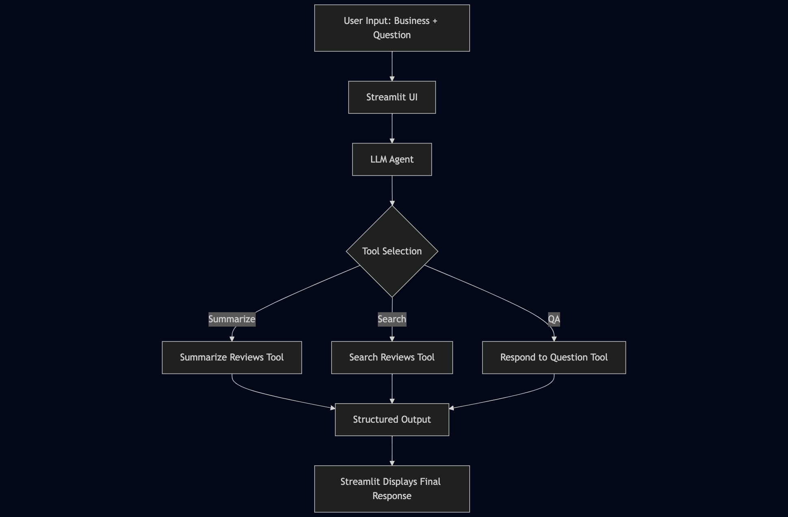

# 🧠 Reviews AI Agent

An AI-powered agent that analyzes Google Maps reviews to generate detailed summaries and respond to user questions. Built using modern LLM orchestration tools, this project combines information retrieval, vector search, and agentic decision-making to extract actionable insights from user-generated content.

---

## 💡 Project Overview

**Reviews AI Agent** is a conversational assistant designed to:
- Summarize user reviews (both positive and negative) for a given business.
- Answer specific questions based on real customer feedback.
- Support business intelligence, reputation analysis, and competitive insights.

This is achieved through a tool-using agent architecture powered by GPT-4 and LangChain, with semantic search over vectorized Google Maps reviews.

---

## 🧱 Architecture Overview

The system follows a **modular architecture** consisting of:

1. **Data Ingestion + Vector Store**
   - CSV-based dataset with Google Maps reviews.
   - Reviews are split, embedded (`MiniLM` via HuggingFace), and stored in a persistent Chroma DB.
   - Each vector retains metadata (e.g. business name, rating) to allow filtered semantic search.

2. **LLM Tools (LangChain Tools)**
   - `search_reviews`: Retrieves relevant review snippets given a query.
   - `summarize_reviews`: Summarizes the most relevant reviews (all, positive, or negative).
   - `respond_question`: Performs retrieval-augmented QA based on filtered reviews.

3. **Agent Orchestration**
   - Zero-shot agent (OpenAI GPT-4 via LangChain) selects the appropriate tool.
   - Structured prompt guides response format (e.g. multi-paragraph, contrastive reasoning).
   - Decisions are fully autonomous: the LLM picks which tool to invoke based on the user input.

4. **Streamlit UI**
   - Interactive app with inputs for business name and natural language queries.
   - Results shown live with agent-generated outputs.
   - Easily deployable locally or as a lightweight internal dashboard.

---

## 🔄 Pipeline



---

## 🧰 Tech Stack

| Layer                | Tools & Frameworks                                                                 |
|----------------------|-------------------------------------------------------------------------------------|
| **LLM Orchestration**| [LangChain](https://www.langchain.com/), GPT-4 (via OpenAI API)                    |
| **Embedding**        | `all-MiniLM-L6-v2` via Hugging Face Transformers                                   |
| **Vector DB**        | [Chroma](https://www.trychroma.com/) for semantic retrieval                        |
| **Frontend**         | [Streamlit](https://streamlit.io/)                                                 |
| **Data Handling**    | `pandas`, `tqdm`, `click`, `dotenv`                                                 |
| **Agent Strategy**   | Tool-using agent with zero-shot reasoning (`initialize_agent` from LangChain)      |

---

## 🧠 Design Decisions

- **Agent over hard-coded logic**: Instead of conditional logic or branching, a **LLM agent dynamically selects tools** based on the user's request, making the system highly adaptable.
- **Business-aware retrieval**: Vector retrievers are scoped per business to reduce noise and ensure relevant matches.
- **Structured output prompt**: The agent is instructed to generate well-structured responses (e.g., balanced pros/cons with examples).
- **Local-first, fast prototyping**: Built to run offline-first (Chroma DB, Streamlit) with minimal infrastructure requirements.

---

## 📁 Repository Structure

```
.
├── data/                    # Input datasets (CSV with reviews)
├── db/                      # Persisted Chroma vector store (not available in the repository due to the size of the db)
├── agent/
│   └── tools.py             # Tools used by the LLM agent
├── vector.py                # Vector retrieval setup & logic
├── scripts/
│   └── init_vectorstore.py  # CLI script to build the vector store
├── ui/
│   └── app_streamlit.py     # Streamlit front-end + agent orchestration
├── requirements.txt         # Python dependencies
└── README.md
```

---

## 🚀 Getting Started

```bash
# 1. Clone the repo
git clone https://github.com/bpeco/reviews-ai-agent.git
cd reviews-ai-agent

# 2. Install dependencies
pip install -r requirements.txt

# 3. Initialize the vector store
python scripts/init_vectorstore.py --data data/reviews.csv

# 4. Run the app
streamlit run ui/app_streamlit.py
```

> 🔐 Make sure to add your `OPENAI_API_KEY` in a `.env` file before launching.

---

## 🧪 Examples

**Input:**
> _"What do customers say about the parking space at SushiClub Palermo?"_

**Output (Agent Response):**
> Most reviews do not mention parking explicitly. However, one reviewer noted: “It's hard to find parking nearby during peak hours.” This suggests that while parking may not be a central concern, it can be a minor issue during busy periods.

---

## ✨ Future Work

- [ ] Replace CSV ingestion with Google Maps scraping pipeline.
- [ ] Add memory and multi-turn conversations.

---

## 🧠 Author

Built by [@bpeco](https://github.com/bpeco) — AI Engineer focused on tool-using agents, LLM infrastructure and real-world GenAI applications.

---
